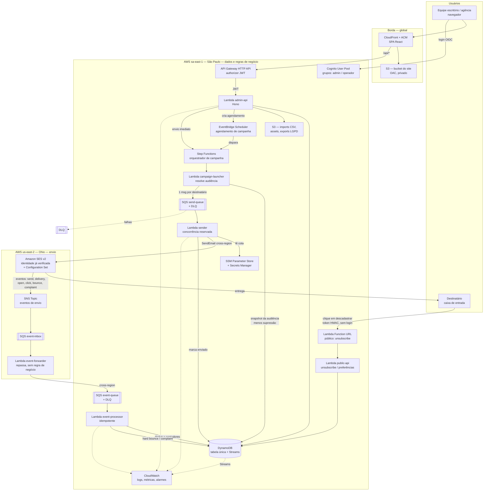
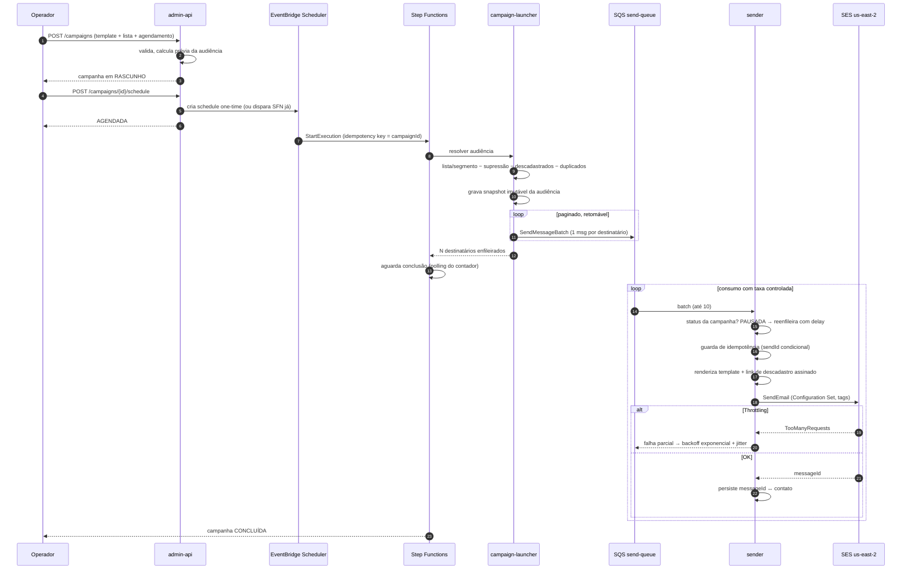
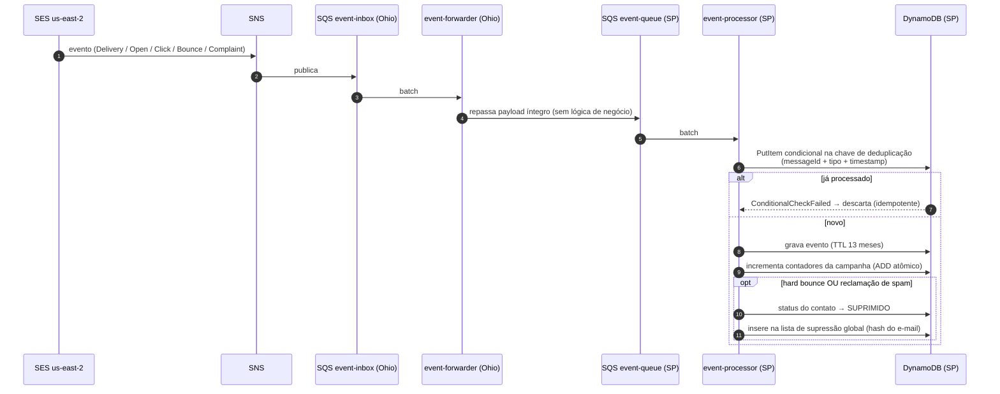
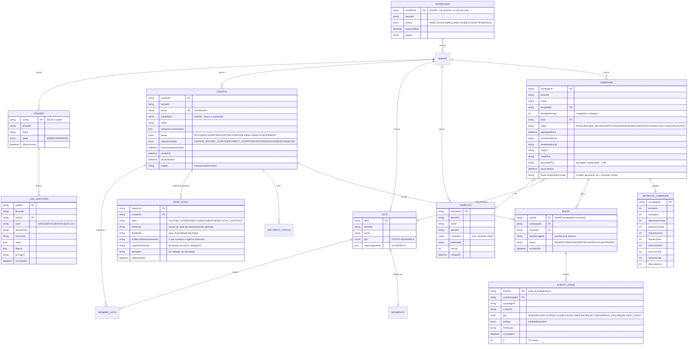
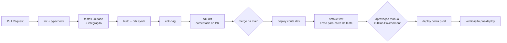

# Arquitetura — Sistema de E-mail Marketing

**Escritório:** André Araújo Advogados
**Versão:** 1.0 — todas as decisões arquiteturais fechadas · **Data:** 2026-08-06
**Status:** 🟢 Completo · aguardando o aval final para iniciar o scaffolding — nenhuma implementação iniciada

> **Decisões fechadas em 2026-08-06:**
> `sa-east-1` para dados + `us-east-2` para envio · DynamoDB · base legal LGPD = **legítimo interesse** (art. 7º, IX) · **duas contas AWS** (dev/prod) · painel em `campanhas.andrearaujoadvogados.com.br` · domínio de rastreamento `link.mail.andrearaujoadvogados.com.br` · `tenantId` presente desde o dia 1 · estado **`EM_REVISÃO`** (aprovação por advogado responsável) incluído no MVP.
> Pendência que não bloqueia o desenvolvimento: a base de contatos ainda não foi disponibilizada (§14).

---

## 0. Sumário executivo

Sistema serverless de campanhas de e-mail sobre Amazon SES, com painel administrativo web, fila de envio com controle de taxa, rastreamento de eventos, supressão automática e descadastro sem login.

**Decisões-chave (detalhadas na seção 3):**

| #      | Decisão                  | Escolha                                                                                       | Principal alternativa descartada                                 |
| ------ | ------------------------ | --------------------------------------------------------------------------------------------- | ---------------------------------------------------------------- |
| ADR-01 | Distribuição regional    | Dados e aplicação em `sa-east-1`; SES e ingestão de eventos em `us-east-2` com ponte fina     | Tudo em `us-east-2` (mais simples e barato, pior narrativa LGPD) |
| ADR-02 | Persistência             | DynamoDB (single-table) + S3/Athena para analytics em V2                                      | PostgreSQL (Aurora Serverless v2 / RDS)                          |
| ADR-03 | Destino de eventos SES   | Configuration Set → SNS → SQS → Lambda                                                        | Kinesis Firehose; EventBridge; SNS→Lambda direto                 |
| ADR-04 | Compute                  | Lambda (ARM64, Node 22) — "lambdalith" na API admin, Lambdas dedicadas para público e workers | Fargate; uma Lambda por rota                                     |
| ADR-05 | Orquestração de campanha | Step Functions (orquestrador) + SQS/Lambda (loop de envio)                                    | Só SQS; Step Functions Distributed Map puro                      |
| ADR-06 | IaC                      | AWS CDK v2 (TypeScript)                                                                       | Terraform; SAM; Serverless Framework                             |
| ADR-07 | Renderização de template | Renderização própria (LiquidJS) + `SendEmail`                                                 | Templates nativos do SES + `SendBulkEmail`                       |

**Custo estimado:** US$ 12–25/mês em volume baixo (~20k e-mails/mês), dos quais ~US$ 6–9 são custo fixo independente de uso. Detalhamento na seção 13.

**Ressalva que registro desde já:** a maior fonte de complexidade evitável neste desenho é a separação de regiões (ADR-01). Ela é justificável, mas se você preferir simplicidade máxima e menor custo, consolidar tudo em `us-east-2` remove ~15% do esforço de implementação. Deixei a decisão explícita e reversível — ver seção 14.

---

## 1. Contexto e premissas

### 1.1 Infraestrutura existente (não será reprojetada)

| Item                               | Valor                                                                                                               | Observação para o desenho                                          |
| ---------------------------------- | ------------------------------------------------------------------------------------------------------------------- | ------------------------------------------------------------------ |
| Conta AWS que hospeda a identidade | `874726179037`                                                                                                      | ⚠️ Ver §9.1.1 — a titularidade desta conta precisa ser confirmada  |
| Identidade de domínio SES          | `mail.andrearaujoadvogados.com.br`                                                                                  | Região `us-east-2` — fixa o SES nessa região                       |
| MAIL FROM personalizado            | `bounce.mail.andrearaujoadvogados.com.br`                                                                           | Melhora alinhamento SPF; bounces retornam por esse domínio         |
| DKIM                               | Easy DKIM, 3 CNAMEs, **verificado** — confirmado pelo AWS Health em 2026-08-06 (`AWS_SES_DKIM_PENDING_TO_VERIFIED`) | Tokens são **por região e por conta** — relevante se um dia migrar |
| SPF                                | Configurado e verificado                                                                                            | —                                                                  |
| DMARC                              | `p=none` em `_dmarc.mail.andrearaujoadvogados.com.br`                                                               | Ver item 1.3                                                       |
| Conta SES                          | **Sandbox**; produção em análise                                                                                    | Cota atual: 200 e-mails/24h, 1 msg/s                               |
| Plano                              | Essentials — sem IP dedicado, sem Mail Manager avançado                                                             | Sem VDM avançado/IP warm-up gerenciado                             |

### 1.2 Premissas de volume

- Lista de até ~5.000 contatos.
- 2 a 6 campanhas por mês → ordem de 20.000 e-mails/mês em regime.
- Menos de 20 usuários no painel (escritório + agência).
- Sem requisito de tempo real: uma campanha levar 1–2h para completar o disparo é aceitável.

> Essas premissas dirigem **todas** as escolhas de custo. Se o volume real for 10× maior, o ADR-02 (DynamoDB) e o ADR-04 (Lambda) continuam válidos; o que muda é a cota do SES e o custo variável.

### 1.3 Restrições e dependências externas

1. **Sandbox do SES é bloqueador de MVP em produção.** Enquanto não sair, só é possível enviar para endereços verificados. O sistema deve funcionar em sandbox (ambiente de dev usa exatamente isso), mas o go-live depende da aprovação da AWS.
2. **Cota é um parâmetro, não uma constante.** O limitador de taxa lê a cota de um parâmetro no SSM, atualizado diariamente por uma Lambda que consulta `GetAccount`/`SendQuota` no SES. Assim a liberação de produção não exige deploy.
3. **DMARC em `p=none`** é adequado para a fase de observação. Recomendo evoluir para `p=quarantine` (e depois `p=reject`) **depois** de 2–4 semanas de relatórios agregados limpos — é uma tarefa de operação, não de código, mas entra no roadmap (seção 12).
4. **Regras de remetente em massa (Gmail/Yahoo, vigentes desde 2024)** são requisito de entregabilidade, não opcional: autenticação (já feita), taxa de spam abaixo de 0,3%, e **descadastro em um clique via cabeçalho `List-Unsubscribe` com POST (RFC 8058)**. Isso está no desenho desde o MVP (seção 4.6).

---

## 2. Visão geral da arquitetura

### 2.1 Diagrama de componentes e fluxo de dados



### 2.2 Sequência: da criação da campanha ao envio



### 2.3 Sequência: rastreamento de eventos e supressão



---

## 3. Decisões arquiteturais (ADRs)

### ADR-01 — Dados em `sa-east-1`, envio em `us-east-2` ✅ **CONFIRMADO**

**Decisão:** o plano de dados e as regras de negócio ficam em `sa-east-1` (São Paulo). O SES e a ingestão bruta de eventos permanecem em `us-east-2`, onde a identidade já está verificada. Uma Lambda "forwarder" sem lógica de negócio faz a ponte.

**Por quê:**

- A LGPD **não exige** residência de dados no Brasil — transferência internacional é lícita (art. 33) e a AWS oferece cláusulas contratuais no DPA. Portanto isso é escolha de postura, não de legalidade.
- Ainda assim, para um **escritório de advocacia**, "os dados dos seus contatos ficam armazenados em São Paulo" é uma afirmação de valor concreto perante clientes e perante o próprio encarregado de dados. Reduz atrito na política de privacidade e no registro de operações (ROPA).
- O custo incremental é pequeno neste volume: `sa-east-1` tem prêmio de preço (~15–50% conforme o serviço), mas sobre uma base de poucos dólares.
- A latência extra São Paulo↔Ohio (~120 ms por chamada `SendEmail`) é irrelevante quando a cota é de 1–14 mensagens/segundo.

**Consequências:**

- Destinos de evento do SES são regionais → o pipeline de eventos nasce em Ohio e precisa da ponte. Custo: uma fila e uma Lambda a mais.
- Certificado do CloudFront precisa estar em `us-east-1` (requisito do serviço) → o app CDK terá 3 regiões: `sa-east-1` (núcleo), `us-east-2` (envio), `us-east-1` (ACM). O CDK lida com isso via `crossRegionReferences`.
- ~~**Ponto de reversão**~~ — **decisão fechada em 2026-08-06.** A reversão para região única deixa de ser considerada; as stacks do CDK já nascem separadas por região.
- ⚠️ **Reforço decorrente da base legal escolhida:** com legítimo interesse (ver 10.2), a residência dos dados no Brasil deixa de ser só postura e passa a ser argumento útil no teste de balanceamento — a expectativa legítima do titular é melhor atendida quando o dado não sai do país. Isso valida a escolha.

**Opção futura (não recomendada agora):** re-verificar a identidade em `sa-east-1` e migrar o envio. Exigiria novos CNAMEs de DKIM (tokens são por região), novo registro MX de MAIL FROM (`feedback-smtp.sa-east-1.amazonses.com`), **nova solicitação de acesso a produção** e novo aquecimento de reputação. Não vale a pena agora — a reputação já construída em Ohio é um ativo.

---

### ADR-02 — DynamoDB como armazenamento primário ✅ **CONFIRMADO**

**Decisão:** DynamoDB em modo sob demanda, com design de tabela única, como banco operacional. Analytics ad-hoc, se necessário, via export para S3 + Athena (V2).

**Por quê:**

- **Custo ocioso zero.** É o critério dominante do briefing. Alternativas relacionais têm piso: RDS `db.t4g.micro` ~US$ 15–20/mês em `sa-east-1` + armazenamento; Aurora Serverless v2 mesmo com mínimo de 0 ACU cobra armazenamento e tem latência de retomada.
- **Evita VPC.** Postgres exigiria Lambdas dentro de VPC, o que traz NAT Gateway (~US$ 35/mês — mais caro que todo o resto da arquitetura somada) ou uma malha de VPC endpoints. DynamoDB é acessado pela API pública com IAM, sem VPC. **Esta é a maior economia isolada do desenho.**
- Os padrões de acesso são conhecidos e estáveis (listados na seção 6.3) — o cenário em que DynamoDB é forte.
- Contadores atômicos (`ADD`) resolvem as métricas de campanha sem agregação batch.
- Escrita condicional (`attribute_not_exists`) é a primitiva natural de idempotência, que é requisito explícito.

**Contra o que eu pesei:** Postgres seria mais confortável para segmentação ad-hoc, relatórios agregados e para a equipe. Reconheço isso abertamente.

**Gatilho documentado para mudar de ideia:** se a segmentação por critérios arbitrários combinados (V2) virar função central, a saída **não** é migrar tudo — é adicionar um modelo de leitura via CQRS: DynamoDB Streams → Lambda → Aurora Serverless v2 (ou OpenSearch Serverless). O modelo de escrita permanece. Esse caminho está previsto na seção 5 e no roadmap.

---

### ADR-03 — Eventos do SES via SNS → SQS → Lambda

**Decisão:** o Configuration Set publica em um tópico SNS; o tópico entrega a uma fila SQS; a Lambda consome da fila.

**Por quê a fila entre o SNS e a Lambda:** o SNS entregando direto a uma Lambda tem política de retentativa limitada e sem buffer durável — um incidente prolongado no consumidor perde eventos. Com SQS há retenção de até 14 dias, DLQ, processamento em lote, falha parcial por item (`ReportBatchItemFailures`) e reprocessamento manual trivial.

**Alternativas descartadas:**

- **Kinesis Data Firehose → S3:** ótimo para arquivo bruto e análise histórica, ruim como caminho operacional — buffer mínimo de tempo/tamanho introduz atraso, cobra por GB ingerido e não oferece retentativa nem DLQ por mensagem. **Não descartado para sempre:** um segundo destino de evento com Firehose → S3 (Parquet) é a base do data lake de analytics na V2, e custa quase nada em paralelo.
- **EventBridge como destino de evento:** viável e elegante para roteamento por tipo de evento, mas adiciona uma camada de regras sem ganho concreto neste escopo, e o par SNS+SQS é mais direto de operar e depurar.
- **SNS entregando direto a uma fila em outra região:** evitei depender disso. A ponte por Lambda é explícita, testável e não depende de comportamento cross-region do SNS.

---

### ADR-04 — Lambda, com granularidade mista

**Decisão:** todo compute em Lambda (ARM64/Graviton, Node.js 22). Granularidade:

- **API administrativa:** uma única Lambda ("lambdalith") com roteamento interno via Hono.
- **Endpoints públicos** (descadastro, preferências): Lambdas dedicadas, mínimas.
- **Workers assíncronos:** uma Lambda por responsabilidade (launcher, sender, event-processor, event-forwarder, csv-importer, quota-sync).

**Por quê:**

- Fargate teria custo fixo de tarefa ociosa — contraria o briefing.
- Uma Lambda por rota daria IAM mais granular, mas multiplica artefatos, cold starts e código de infraestrutura para uma equipe pequena. Como toda a API administrativa está atrás de autenticação e opera sobre o mesmo conjunto de dados, o ganho de isolamento é marginal.
- Os endpoints **públicos** são a superfície exposta à internet sem autenticação — esses merecem isolamento real e permissão mínima (só leem/escrevem status de contato). Por isso ficam separados.
- ARM64 é ~20% mais barato com o mesmo desempenho para Node.
- Function URL no descadastro em vez de API Gateway: menos uma cobrança por requisição e menos superfície; não precisamos de WAF/authorizer nesse caminho (a proteção é o token HMAC).

---

### ADR-05 — Step Functions orquestra, SQS executa

**Decisão:** Step Functions (workflow Standard) controla o ciclo de vida da campanha; o disparo em si roda em SQS + Lambda.

**Por quê:**

- Resolver a audiência de milhares de contatos e enfileirar pode exceder os 15 min de uma Lambda. Step Functions com paginação torna isso retomável e observável sem código de checkpoint próprio.
- O histórico de execução é auditoria pronta: dá para ver exatamente onde uma campanha parou.
- Mas o **loop de envio** não deve ser Step Functions: a Distributed Map não oferece pausa nativa e cobraria transições de estado por destinatário. SQS dá controle de taxa, retentativa com backoff, DLQ e pausa lógica por centavos.

**Pausar/cancelar:** o `sender` consulta o status da campanha uma vez por lote (com cache em memória de poucos segundos entre invocações quentes). `PAUSADA` → a mensagem volta à fila com `DelaySeconds`. `CANCELADA` → descarta e marca o destinatário como não enviado. Não há corrida destrutiva: o pior caso é um punhado de e-mails já em voo quando a pausa foi acionada — isso deve ser dito na interface ("a pausa vale para os próximos envios").

---

### ADR-06 — AWS CDK v2 em TypeScript

**Decisão:** CDK v2, TypeScript, com `cdk-nag` no pipeline.

**Por quê:** mesma linguagem do resto do time (critério explícito do briefing); construtos L2 encapsulam bem SES Configuration Set, SQS+DLQ, Lambda com bundling esbuild e permissões IAM mínimas geradas automaticamente (`grantX`), que é justamente onde se erra à mão; deploy multi-região no mesmo app; `cdk diff` legível na revisão de PR.

**Terraform** seria a escolha se houvesse multi-cloud ou uma equipe de plataforma já fluente em HCL — não é o caso, e o `terraform plan` não compensa a mudança de linguagem aqui. **SAM** é bom para serverless puro mas fraco no restante (CloudFront, Cognito, Scheduler). **Serverless Framework** foi descartado por mudança de licenciamento e por acoplar o desenho ao seu modelo.

---

### ADR-07 — Renderização própria de template

**Decisão:** renderizamos o HTML na nossa Lambda com **LiquidJS** e enviamos via `SendEmail`, um destinatário por chamada.

**Por quê:**

- Templates ficam versionados no nosso banco, com prévia, teste e histórico de auditoria — não sincronizados como recursos do SES, o que evita divergência entre ambientes.
- Liquid é sandboxed (não executa código arbitrário), é o dialeto que profissionais de marketing já reconhecem, e falha de forma previsível com variável ausente.
- Precisamos injetar por destinatário: link de descadastro assinado, cabeçalho `List-Unsubscribe` e identificadores de rastreamento. Controle total simplifica isso.

**Trade-off aceito:** `SendBulkEmail` enviaria até 50 destinos por chamada e reduziria chamadas de API. Em 20k e-mails/mês isso é irrelevante. Por isso o envio fica atrás de uma interface `EmailProvider` (padrão Strategy) — trocar para envio em lote depois é uma implementação nova, não uma refatoração.

---

## 4. Stack de tecnologia

### 4.1 Backend

| Camada               | Escolha                                                                               | Justificativa                                                                                                                         |
| -------------------- | ------------------------------------------------------------------------------------- | ------------------------------------------------------------------------------------------------------------------------------------- |
| Runtime              | Node.js 22 LTS, ARM64                                                                 | Linguagem do time; ARM ~20% mais barato                                                                                               |
| Linguagem            | TypeScript (strict)                                                                   | Contratos compartilhados com o frontend                                                                                               |
| Roteamento HTTP      | **Hono**                                                                              | Minúsculo, TS-first, adaptador Lambda nativo, cold start baixo. Alternativa: Fastify + adapter (mais pesado); Express (desnecessário) |
| Validação            | **Zod**                                                                               | Schema único que serve de validação em runtime e de tipo em build; gera OpenAPI                                                       |
| Template de e-mail   | **LiquidJS** + `juice` (inline CSS) + `html-to-text` (parte texto)                    | Multipart alternativo é fator de entregabilidade, não estética                                                                        |
| Sanitização          | `sanitize-html` na gravação, DOMPurify na prévia                                      | Templates são HTML autoral — mitiga XSS no painel                                                                                     |
| CSV                  | `csv-parse` em streaming                                                              | Processa arquivos grandes sem estourar memória                                                                                        |
| Utilidades de Lambda | **AWS Lambda Powertools for TypeScript**                                              | Logger estruturado, métricas EMF, tracer e — decisivo — o módulo **Idempotency** pronto sobre DynamoDB, que é requisito explícito     |
| SDK AWS              | AWS SDK v3, modular, com retry adaptativo                                             | Backoff exponencial com jitter já embutido                                                                                            |
| Testes               | Vitest (unidade) + Testcontainers/DynamoDB Local (integração) + `aws-sdk-client-mock` | Domínio testável sem AWS por causa da arquitetura hexagonal                                                                           |

### 4.2 Frontend (painel administrativo)

| Camada             | Escolha                                                       | Justificativa                                                                                                                   |
| ------------------ | ------------------------------------------------------------- | ------------------------------------------------------------------------------------------------------------------------------- |
| Framework          | **React 19 + TypeScript + Vite**                              | SPA pura; sem SEO nem SSR a justificar Next.js — e Next.js na AWS exige Amplify/OpenNext, custo e complexidade sem retorno aqui |
| Estado de servidor | TanStack Query                                                | Cache, revalidação e estados de carregamento sem Redux                                                                          |
| Roteamento         | React Router                                                  | Padrão, suficiente                                                                                                              |
| UI                 | Tailwind + shadcn/ui                                          | Componentes acessíveis, sem lock-in de biblioteca; velocidade de entrega                                                        |
| Formulários        | React Hook Form + Zod (mesmos schemas do backend)             | Validação idêntica nas duas pontas, sem duplicar regra                                                                          |
| Auth               | AWS Amplify Auth (só o módulo de autenticação) contra Cognito | Fluxo OIDC, refresh de token e MFA sem escrever a mão                                                                           |
| Gráficos           | Recharts                                                      | Relatórios simples; leve                                                                                                        |
| Hospedagem         | S3 privado + CloudFront (OAC) + ACM                           | Custo praticamente zero, TLS, cache global                                                                                      |

### 4.3 Infraestrutura como código

AWS CDK v2 (TypeScript) · `cdk-nag` (regras AWS Solutions) no CI · `projen` **não** recomendado (abstração a mais para uma equipe pequena).

---

## 5. Padrões de projeto

Cada padrão abaixo entra por um motivo concreto deste sistema — não por completude.

### 5.1 Arquitetura hexagonal (ports & adapters)

**Onde:** `packages/core` (domínio + casos de uso, zero import de `aws-sdk`) contra `packages/adapters-aws`.
**Por quê aqui:** o SES é a peça mais sujeita a mudança externa (cota, migração de região, troca eventual de provedor) e a regra de negócio mais sensível (supressão, descadastro) é justamente a que precisa ser testável em milissegundos, sem AWS. A fronteira paga por si na primeira semana de testes.

### 5.2 Repository

**Onde:** `ContactRepository`, `CampaignRepository`, `SuppressionRepository` etc., com implementação DynamoDB.
**Por quê:** isola o design single-table (chaves compostas, GSIs) do domínio. Se o ADR-02 for revisitado, a troca fica confinada. Também permite implementação em memória nos testes.

### 5.3 Strategy — `EmailProvider`

**Onde:** interface `EmailProvider.send(message)` com `SesEmailProvider` como única implementação inicial.
**Por quê:** contempla o cenário explícito do briefing (outro provedor no futuro) e, mais imediato, permite um `FakeEmailProvider` em dev/sandbox e um `SesBulkEmailProvider` se o volume crescer.

### 5.4 Consumidor idempotente

**Onde:** `event-processor` e `sender`.
**Como:** chave determinística + `PutItem` condicional em uma tabela de deduplicação com TTL.

- Eventos: `sha256(messageId + eventType + timestamp)`.
- Envios: `sendId = sha256(campaignId + contactId)` — grava **antes** de chamar o SES; se já existe, o destinatário já foi processado.
  **Por quê:** SNS e SQS padrão são _at-least-once_. Sem isso, uma redistribuição de mensagem gera e-mail duplicado (dano reputacional) ou contadores inflados (relatório errado). É requisito explícito do briefing.

### 5.5 Retry com backoff exponencial + jitter, e circuit breaker

**Onde:** toda chamada ao SES.
**Como:** retry adaptativo do SDK para erros transitórios; `TooManyRequestsException` devolve o item à fila via falha parcial, deixando a visibilidade do SQS aplicar o backoff. **Circuit breaker** (estado em DynamoDB, TTL curto) para erros não-transitórios de conta: se o SES devolver `AccountSendingPausedException` ou falha de credencial N vezes seguidas, o circuito abre, o `sender` para de consumir e um alarme dispara — em vez de queimar a fila inteira em DLQ.
**Por quê:** com cota de 1 msg/s, throttling é o caminho normal, não a exceção. Tratar throttling como erro seria arquitetura errada.

### 5.6 Token bucket para controle de taxa

**Onde:** `sender`.
**Como:** concorrência reservada da Lambda + limitador interno que lê `maxSendRate` e `dailyQuota` do SSM Parameter Store; contador diário em DynamoDB com incremento condicional. Ao atingir a cota de 24h, as mensagens voltam à fila com atraso até a próxima janela, em vez de falharem.
**Por quê:** respeita a cota atual (1/s) e absorve a futura (14/s ou mais) mudando um parâmetro, sem deploy.

### 5.7 CQRS "leve"

**Onde:** escrita de campanhas e contatos no modelo transacional; leitura de relatórios em contadores pré-agregados por campanha, atualizados por `ADD` atômico no `event-processor`.
**Por quê:** relatório de campanha é leitura frequente sobre agregação de milhares de eventos — varrer eventos a cada abertura de tela seria caro e lento. Note que isso é CQRS parcial e deliberado: **não** proponho event sourcing nem barramento de comandos, que seriam sobre-engenharia neste porte.

### 5.8 Saga / máquina de estados

**Onde:** ciclo de vida da campanha, com transições validadas no domínio e a fase de disparo orquestrada pelo Step Functions:

```
RASCUNHO → EM_REVISÃO → APROVADA → AGENDADA → ENVIANDO ⇄ PAUSADA → CONCLUÍDA
     ↑__________|                       └──────────────────────────→ CANCELADA
```

**Por quê:** torna ilegal representar estados impossíveis (pausar uma campanha concluída, agendar uma não aprovada) e dá compensação clara em falha parcial.

⚠️ **Regra da aprovação:** só o papel `ADMIN` aprova. A exigência de que o aprovador fosse **outra pessoa** caiu em 2026-08-08, por decisão do escritório: o sistema é de uso interno e quem escreve as campanhas é o advogado responsável por elas — a segunda pessoa não acrescentava revisão, só um passo que não podia ser cumprido. A etapa em si permanece, e não como formalidade: é o último ponto de parada antes de um disparo irreversível. A aprovação grava `aprovadoPor`, `aprovadoEm` e um **hash do conteúdo aprovado** — qualquer edição posterior de template, assunto ou audiência invalida a aprovação e devolve a campanha para `EM_REVISÃO`. Sem esse hash, "aprovado" seria um carimbo sem valor probatório, que é justamente o oposto do que a exigência da OAB pede.

### 5.9 Specification pattern

**Onde:** regras de segmentação (`SegmentSpecification` combinável por E/OU/NÃO).
**Por quê:** permite que o MVP tenha segmentos simples e a V2 componha critérios sem reescrever o resolvedor de audiência.

### 5.10 Anti-corruption layer

**Onde:** tradutor entre o payload de notificação do SES e o `SendEventDomain` interno.
**Por quê:** o formato do SES é aninhado, inconsistente entre tipos de evento e fora do nosso controle. Traduzir na borda impede que essa forma vaze para o domínio e para o banco.

### 5.11 Outbox — via DynamoDB Streams

**Onde:** mudanças de estado relevantes (contato suprimido, campanha concluída) propagadas por Streams.
**Por quê:** evita escrita dupla (banco + fila) sem transação distribuída. O Stream _é_ o outbox, sem tabela extra.

### 5.12 Value objects e domínio explícito

`EmailAddress` (normaliza minúsculas e valida), `ContactStatus`, `CampaignId`. Evita a classe de bug mais comum em e-mail marketing: o mesmo endereço tratado como duas pessoas por diferença de caixa ou espaço.

---

## 6. Modelagem de dados

### 6.1 Modelo lógico (entidades e relacionamentos)



### 6.2 Notas de modelagem que importam

1. **`tenantId` existe desde o dia 1**, mesmo com um único valor fixo (`andrearaujo`). É o ponto de extensão multi-cliente (seção 12, V3): sem ele, a migração exigiria reescrever todas as chaves.
2. **`emailHash` na supressão, não o e-mail em claro.** Quando um titular exerce o direito de exclusão (LGPD art. 18), apagamos o contato — mas se apagássemos também o registro de descadastro, uma reimportação futura do CSV traria a pessoa de volta. Guardar o hash SHA-256 salgado permite honrar a supressão sem reter o dado pessoal identificável. É a solução de minimização correta para esse conflito, e precisa constar na política de privacidade.
3. **`templateVersao` é congelada na campanha.** Editar um template não pode alterar retroativamente o que foi enviado — isso quebraria a auditoria.
4. **Snapshot imutável da audiência** no lançamento: a campanha envia para quem estava elegível no momento do disparo, não para uma consulta reavaliada a cada mensagem. Torna o disparo determinístico e retomável.
5. **TTL de 13 meses nos eventos**, com métricas agregadas retidas indefinidamente. Atende à minimização sem perder o histórico de relatórios.
6. ⚠️ **`relacionamento` é campo obrigatório, decorrente da base legal escolhida.** Consentimento se prova com um registro de aceite; legítimo interesse se prova com o **vínculo** entre titular e escritório. Sem esse campo não há como demonstrar a base legal em uma fiscalização, nem como impedir que um contato sem vínculo entre na campanha. Por isso:
   - o import CSV **exige** mapear uma coluna de relacionamento ou atribuir um valor único ao arquivo inteiro;
   - `DESCONHECIDO` é um estado válido no cadastro, mas **inelegível para campanha** — o `campaign-launcher` o trata como suprimido até que alguém classifique. Isso transforma um risco jurídico em uma tarefa visível na interface.
7. ⚠️ **`OPOSICAO` é distinto de `DESCADASTRADO`.** Sob legítimo interesse, o titular tem direito de oposição ao tratamento (art. 18, §2º), que é mais amplo que parar de receber e-mail: significa cessar o tratamento. `DESCADASTRADO` sai das campanhas; `OPOSICAO` sai das campanhas **e** dispara o fluxo de revisão/eliminação. Tratar os dois como a mesma coisa seria atender mal um direito que a base legal escolhida torna especialmente relevante.

### 6.3 Padrões de acesso e desenho da tabela única

Tabela `emailmkt-main`, PK `pk` / SK `sk`, mais GSIs.

| #   | Padrão de acesso                                | Acesso                                                                        |
| --- | ----------------------------------------------- | ----------------------------------------------------------------------------- |
| 1   | Contato por id                                  | `pk=TENANT#t#CONTACT#id`, `sk=META`                                           |
| 2   | Contato por e-mail                              | GSI1: `gsi1pk=TENANT#t#EMAIL#hash`                                            |
| 3   | Contatos de uma lista, paginado                 | `pk=TENANT#t#LIST#id`, `sk` começa com `MEMBER#`                              |
| 4   | Listas de um contato                            | GSI2 invertido                                                                |
| 5   | Contatos por status                             | GSI3: `gsi3pk=TENANT#t#STATUS#ATIVO`                                          |
| 6   | Campanha por id + métricas                      | `pk=TENANT#t#CAMPAIGN#id`, `sk in (META, METRICS)`                            |
| 7   | Campanhas por status/data                       | GSI3: `gsi3pk=TENANT#t#CAMPAIGN_STATUS#x`, `gsi3sk=data`                      |
| 8   | Envios de uma campanha                          | `pk=TENANT#t#CAMPAIGN#id`, `sk` começa com `SEND#`                            |
| 9   | Envio por `sesMessageId` (correlação de evento) | GSI4: `gsi4pk=MSG#sesMessageId`                                               |
| 10  | Eventos de um envio                             | `pk=TENANT#t#SEND#sendId`, `sk=EVT#ts#hash`                                   |
| 11  | Supressão — existe?                             | `pk=TENANT#t#SUPPRESS#emailHash` (GetItem, o caminho mais quente do launcher) |
| 12  | Auditoria por período                           | `pk=TENANT#t#AUDIT#YYYY-MM`, `sk=ts#auditId`                                  |
| 13  | Deduplicação de evento                          | tabela separada `emailmkt-idempotency`, com TTL                               |

Tabelas: `emailmkt-main` (principal), `emailmkt-idempotency` (Powertools, TTL curto). Streams habilitado na principal.

---

## 7. Serviços AWS

| Serviço                       | Região                | Papel                                                                              | Por que este e não outro                                                                                                                                   |
| ----------------------------- | --------------------- | ---------------------------------------------------------------------------------- | ---------------------------------------------------------------------------------------------------------------------------------------------------------- |
| **Amazon SES v2**             | us-east-2             | Envio, Configuration Set, rastreio de abertura/clique, lista de supressão da conta | Já verificado; integração nativa com eventos                                                                                                               |
| **SNS**                       | us-east-2             | Destino de evento do Configuration Set                                             | Único destino que compõe bem com SQS; ver ADR-03                                                                                                           |
| **SQS** (4 filas + DLQs)      | us-east-2 e sa-east-1 | `event-inbox`, `event-queue`, `send-queue`, `import-queue`                         | Buffer durável, DLQ, falha parcial, controle de taxa                                                                                                       |
| **Lambda**                    | ambas                 | Todo o compute                                                                     | Custo ocioso zero; ver ADR-04                                                                                                                              |
| **Step Functions** (Standard) | sa-east-1             | Ciclo de vida da campanha                                                          | Retomável, auditável; ver ADR-05                                                                                                                           |
| **EventBridge Scheduler**     | sa-east-1             | Agendamento one-time por campanha + tarefas cron (sync de cota, relatório diário)  | Sucessor do CloudWatch Events para agendamento; schedules descartáveis, sem limite prático de regras                                                       |
| **DynamoDB** (2 tabelas)      | sa-east-1             | Persistência + Streams                                                             | Ver ADR-02                                                                                                                                                 |
| **S3** (3 buckets)            | sa-east-1 / us-east-1 | Uploads CSV, assets de e-mail, exports LGPD, site estático                         | Padrão; versionamento e políticas de ciclo de vida                                                                                                         |
| **CloudFront + ACM**          | global / us-east-1    | Entrega do painel, TLS                                                             | Faixa gratuita generosa; OAC mantém o bucket privado                                                                                                       |
| **API Gateway HTTP API**      | sa-east-1             | API administrativa                                                                 | ~1/3 do preço do REST API e authorizer JWT nativo com Cognito; não precisamos de chaves de API nem de planos de uso                                        |
| **Lambda Function URL**       | sa-east-1             | Endpoint público de descadastro                                                    | Sem custo por requisição de API GW; superfície mínima                                                                                                      |
| **Cognito User Pool**         | sa-east-1             | Autenticação e grupos `admin`/`operador`                                           | Sem custo relevante nesta escala; integra direto com o authorizer do HTTP API. Auth0/Clerk custariam mensalidade por conveniência que não precisamos       |
| **SSM Parameter Store**       | sa-east-1             | Configuração e cota do SES                                                         | **Standard é gratuito** — usar aqui e não no Secrets Manager evita US$ 0,40/mês por segredo                                                                |
| **Secrets Manager**           | sa-east-1             | Apenas o segredo de assinatura HMAC do link de descadastro                         | Rotação gerenciada; só onde se justifica o custo                                                                                                           |
| **KMS**                       | sa-east-1             | Criptografia em repouso                                                            | Começar com chaves gerenciadas pela AWS (sem custo); adotar CMK (US$ 1/mês) só se o cliente exigir controle de chave                                       |
| **CloudWatch**                | ambas                 | Logs, métricas EMF, alarmes, dashboard                                             | Nativo, sem operação                                                                                                                                       |
| **X-Ray**                     | sa-east-1             | Tracing amostrado                                                                  | Diagnóstico de cadeia assíncrona; amostragem baixa mantém o custo desprezível                                                                              |
| **Athena + Glue**             | sa-east-1             | Analytics ad-hoc                                                                   | **V2 apenas** — não instalar no MVP                                                                                                                        |
| **WAF**                       | —                     | —                                                                                  | **Descartado no MVP**: US$ 5/mês de ACL + regras, para um painel com <20 usuários conhecidos. Se necessário, restringir por Cognito e rate limit do API GW |
| **VPC / NAT Gateway**         | —                     | —                                                                                  | **Deliberadamente ausente.** Nenhum componente exige VPC. Economia de ~US$ 35/mês                                                                          |

---

## 8. Estrutura do repositório

**Decisão: monorepo único** (pnpm workspaces + Turborepo).

**Por quê:** frontend e backend compartilham schemas Zod e tipos — em repositórios separados isso viraria um pacote publicado com versionamento próprio, o que é sobrecarga desproporcional para uma equipe pequena. Mudanças que atravessam API + UI + infra ficam em um único PR, revisável e revertível de uma vez. CI único. O risco clássico do monorepo (build lento) não existe nesta escala, e o Turborepo dá cache incremental.

```
email-mkt-escritorio/
├── apps/
│   └── admin-web/                  # SPA React + Vite
│       ├── src/{pages,components,hooks,lib}/
│       └── vite.config.ts
│
├── packages/
│   ├── core/                       # ⬅ DOMÍNIO — sem nenhum import de AWS
│   │   ├── src/domain/
│   │   │   ├── contact/            # entidade, value objects, regras de status
│   │   │   ├── campaign/           # máquina de estados
│   │   │   ├── template/
│   │   │   ├── suppression/
│   │   │   └── segment/            # Specification pattern
│   │   ├── src/application/
│   │   │   ├── use-cases/          # CriarCampanha, ImportarContatos, Descadastrar...
│   │   │   └── ports/              # interfaces: repositórios, EmailProvider, Clock, IdGen
│   │   └── src/shared/             # Result<T,E>, erros de domínio
│   │
│   ├── adapters-aws/               # ⬅ IMPLEMENTAÇÕES dos ports
│   │   ├── src/repositories/       # *DynamoRepository
│   │   ├── src/email/              # SesEmailProvider, FakeEmailProvider
│   │   ├── src/queue/              # SqsQueuePublisher
│   │   ├── src/storage/            # S3Storage
│   │   └── src/config/             # SsmConfigProvider, SecretsProvider
│   │
│   ├── contracts/                  # schemas Zod + tipos DTO (frontend ⇄ backend)
│   ├── email-render/               # Liquid + inline CSS + versão texto + link unsub
│   └── tsconfig / eslint-config/   # configs compartilhadas
│
├── services/                       # ⬅ HANDLERS Lambda — camada fina
│   ├── admin-api/                  # lambdalith Hono
│   ├── public-api/                 # unsubscribe, centro de preferências
│   └── workers/
│       ├── campaign-launcher/
│       ├── sender/
│       ├── event-processor/
│       ├── event-forwarder/        # roda em us-east-2
│       ├── csv-importer/
│       └── quota-sync/             # cron: lê cota real do SES → SSM
│
├── infra/                          # ⬅ CDK v2
│   ├── bin/app.ts
│   └── lib/stacks/
│       ├── core-stack.ts           # sa-east-1: DynamoDB, SQS, Lambdas, SFN, Cognito, API
│       ├── sending-stack.ts        # us-east-2: Config Set, SNS, SQS, forwarder
│       ├── web-stack.ts            # us-east-1/global: S3, CloudFront, ACM
│       └── observability-stack.ts  # alarmes, dashboard, tópico de notificação
│
├── docs/
│   ├── ARQUITETURA.md              # este documento
│   ├── adr/                        # decisões futuras, formato ADR
│   ├── RUNBOOK.md                  # o que fazer quando a DLQ enche, bounce sobe, etc.
│   └── LGPD.md                     # ROPA, bases legais, fluxo de direitos do titular
│
├── .github/workflows/
├── turbo.json · pnpm-workspace.yaml
```

**Regra de dependência (verificada por lint, não por disciplina):** `core` não importa `adapters-aws` nem `services`. Um plugin de ESLint com restrição de import quebra o build se alguém violar. Sem isso, a arquitetura hexagonal degrada em três meses.

---

## 9. IaC e CI/CD

### 9.0 Titularidade

O sistema é do escritório André Araújo Advogados. Não há agência nem terceiro envolvido: o desenvolvimento é feito diretamente para o escritório.

| Consequência            | Como fica                                                                                                                                      |
| ----------------------- | ---------------------------------------------------------------------------------------------------------------------------------------------- |
| Recursos AWS            | Conta do escritório (`874726179037`), que é o pagador                                                                                          |
| Domínio do painel       | `campanhas.andrearaujoadvogados.com.br`                                                                                                        |
| Domínio de rastreamento | `link.mail.andrearaujoadvogados.com.br`                                                                                                        |
| Repositório             | `andrearaujoadvogados/andre_campanhas`, privado                                                                                                |
| Operação                | O `RUNBOOK.md` é escrito para quem não construiu o sistema — inclusive para o próprio escritório operar sem depender de quem escreveu o código |

### 9.1 Contas e ambientes ✅ **DUAS CONTAS**

**Confirmado: duas contas AWS** sob uma organização (`dev` e `prod`), ambas de titularidade do escritório. Contas são gratuitas e a separação é a fronteira de isolamento mais forte que existe na AWS.

Nuance específica deste projeto: a identidade SES verificada existe **apenas na conta de produção**. A conta `dev` permanece em **sandbox do SES com endereços de teste verificados** — o que é exatamente o comportamento desejado em dev (impossível enviar para um contato real por engano). Um `FakeEmailProvider` cobre os testes automatizados.

### 9.1.1 Conta AWS

A conta `874726179037`, que hospeda a identidade SES verificada, é do escritório — confirmado em 2026-08-06. Nada a migrar.

Boas práticas pendentes nela:

- A conta que hospeda produção **não deve ser a conta de gestão** da organização. Se `874726179037` virar `prod`, criar uma conta de gestão separada e vazia.
- MFA na raiz, com e-mail raiz em endereço do escritório e custódia clara — não a caixa pessoal de quem configurou.
- O ID da conta entra como contexto do CDK e secret do GitHub Actions, não hardcoded em código.

### 9.1.2 DNS a configurar

Registros **novos**, além dos que já existem (DKIM, SPF, MAIL FROM, DMARC — §1.1):

Os registros de DKIM, SPF, MAIL FROM e DMARC já estão publicados e verificados (§1.1) — não mexer neles.

| Registro                                | Tipo           | Aponta para                                    | Para quê                                   |
| --------------------------------------- | -------------- | ---------------------------------------------- | ------------------------------------------ |
| `campanhas.andrearaujoadvogados.com.br` | A/AAAA (alias) | distribuição CloudFront                        | Painel administrativo                      |
| validação ACM do painel                 | CNAME          | fornecido pelo ACM em `us-east-1`              | Certificado TLS do CloudFront              |
| `link.mail.andrearaujoadvogados.com.br` | CNAME          | endpoint de rastreamento do SES em `us-east-2` | Domínio de rastreamento de abertura/clique |
| validação do domínio de rastreamento    | CNAME          | fornecido pelo ACM em `us-east-2`              | HTTPS nos links rastreados                 |

⚠️ **Dois cuidados no domínio de rastreamento:**

1. Configurar a política de rastreamento como **HTTPS obrigatório**. Um link `http://` em e-mail de escritório de advocacia é aviso de segurança no cliente de e-mail e dano de credibilidade.
2. Trocar o domínio de rastreamento **depois** de campanhas enviadas quebra os links das mensagens já na caixa dos destinatários. Definir agora e não mexer.

O valor exato do CNAME de rastreamento é gerado pelo SES ao configurar o Configuration Set — entrego a lista final de registros no scaffolding, quando o CDK sintetizar os recursos.

### 9.2 Pipeline (GitHub Actions + OIDC)

Sem chaves de acesso de longa duração: o Actions assume um papel IAM via OIDC federado.



- **Aprovação manual antes de produção** é inegociável em um sistema que envia e-mail em nome de um escritório de advocacia: um deploy ruim não é revertível depois que a mensagem saiu.
- `cdk diff` comentado no PR torna mudança de infraestrutura visível na revisão.
- **CDK Pipelines/CodePipeline foi descartado**: US$ 1/mês por pipeline + CodeBuild, para reimplementar o que o Actions já faz de graça.
- Rollback: `cdk deploy` da tag anterior. Cuidado documentado no runbook: rollback **não** desfaz e-mails enviados nem migrações de dados destrutivas.

---

## 10. Segurança e conformidade

### 10.1 Checklist de segurança

- [ ] IAM com menor privilégio por função — cada Lambda com seu papel, permissões geradas por `grantX` do CDK, nunca `*` em recurso.
- [ ] Condição de chave de partição no IAM preparada para multi-tenant (extensão futura).
- [ ] Nenhum segredo em código ou variável de ambiente em texto claro. Configuração → SSM Parameter Store; segredo HMAC → Secrets Manager, lido em runtime com cache.
- [ ] Criptografia em repouso: DynamoDB, S3, SQS e SNS com KMS (chaves gerenciadas pela AWS no MVP).
- [ ] TLS em trânsito em toda parte; política HTTPS no domínio de rastreamento do SES.
- [ ] Buckets S3 privados, Block Public Access, CloudFront com OAC.
- [ ] Cognito: senha forte, MFA obrigatório para o papel `ADMIN`, expiração de sessão.
- [ ] Autorização por papel verificada **no backend** (a UI escondendo um botão não é controle de acesso).
- [ ] Validação de entrada com Zod em toda borda, inclusive nos payloads de fila.
- [ ] Token de descadastro: HMAC-SHA256 com segredo rotacionável, sem dados pessoais no payload, resistente a enumeração; endpoint com rate limit.
- [ ] Sanitização de HTML de template na gravação; prévia isolada em iframe com sandbox.
- [ ] CloudTrail habilitado; logs de auditoria da aplicação imutáveis (sem update/delete pela API).
- [ ] Retenção de logs do CloudWatch definida explicitamente (30 dias) — o padrão "nunca expirar" é um vazamento de custo e de dados.
- [ ] Dependências: Dependabot + `pnpm audit` no CI.

### 10.2 Checklist LGPD

> **Base legal definida: legítimo interesse (art. 7º, IX).** É defensável, e é a escolha pragmática dado que a base existente do escritório não tem registro de consentimento coletado. Mas ela **transfere o ônus da prova para o controlador**: com consentimento, a prova é o aceite; com legítimo interesse, a prova é a documentação de que o tratamento era esperado, necessário e proporcional. Os itens marcados ⚠️ abaixo não existiriam se a base fosse consentimento — são o preço dessa escolha, e nenhum deles é opcional.

- [x] **Base legal definida:** legítimo interesse, registrada por contato na entidade `BASE_LEGAL`.
- [ ] ⚠️ **LIA — teste de balanceamento documentado** (`docs/LGPD.md`), versionado, cobrindo: finalidade legítima, necessidade do tratamento, expectativa legítima do titular e salvaguardas oferecidas. Sem esse documento, a base legal é uma alegação, não uma justificativa. **É um entregável do encarregado de dados do escritório** — mas o sistema referencia sua versão em cada registro.
- [ ] ⚠️ **Vínculo comprovável por contato** (campo `relacionamento` + `evidenciaRelacionamento`). Legítimo interesse não alcança quem nunca teve relação com o escritório.
- [ ] ⚠️ **Direito de oposição em destaque** (art. 18, §2º) — mais forte que o descadastro comum, com status próprio e fluxo próprio.
- [ ] ⚠️ **Transparência reforçada**: o rodapé de todo e-mail deve informar a base legal, a finalidade e como se opor. Sob consentimento bastaria lembrar do aceite.
- [ ] ⚠️ **Revisão periódica da base legal** — o legítimo interesse não é permanente: um ex-cliente de 5 anos atrás dificilmente ainda tem expectativa legítima de receber comunicação. Recomendo revisão anual automatizada, sinalizando contatos cujo `relacionamentoDesde` passou do prazo definido no LIA.
- [ ] **Descadastro sem login, em um clique**, efetivo imediatamente + cabeçalhos `List-Unsubscribe` e `List-Unsubscribe-Post` (RFC 8058) em todo e-mail.
- [ ] **Direito de exclusão (art. 18)**: exclusão do contato mantendo apenas o hash do e-mail na supressão, com justificativa registrada.
- [ ] **Direito de portabilidade**: export JSON/CSV dos dados do titular via S3 presignado, com expiração curta.
- [ ] **Direito de acesso e correção**: centro de preferências público, autenticado por token assinado.
- [ ] **Minimização**: coletar apenas e-mail, nome e campos com finalidade declarada. Campos customizados exigem justificativa no cadastro.
- [ ] **Retenção**: eventos com TTL de 13 meses; contatos inativos há mais de 24 meses entram em revisão; logs de auditoria por 5 anos.
- [ ] **Localização dos dados**: `sa-east-1` (ADR-01). Transferência internacional limitada ao conteúdo do e-mail em trânsito pelo SES em `us-east-2` — **isso precisa constar na política de privacidade**, com a base do art. 33.
- [ ] **Identificação do remetente no rodapé** de todo e-mail: razão social, CNPJ, endereço físico e contato do encarregado. Exigência de LGPD e fator de entregabilidade.
- [ ] **ROPA** (registro de operações de tratamento) documentado em `docs/LGPD.md`.
- [ ] **Sem importação de listas compradas ou de terceiros** — controle de processo, mas o import deve exigir declaração de origem por arquivo.
- [ ] DPA da AWS revisado e arquivado pelo cliente.

### 10.3 Conformidade com as normas de publicidade da OAB

> Vocês conhecem essas regras melhor do que eu, e isto não é orientação jurídica — levanto porque **tem consequência de produto** e é o tipo de coisa que, descoberta depois do MVP pronto, vira retrabalho.

O Código de Ética e Disciplina da OAB e o Provimento nº 205/2021 do Conselho Federal restringem publicidade na advocacia de um jeito que não se aplica a e-mail marketing comum: a comunicação deve ser informativa e discreta, sem mercantilização, sem captação de clientela e sem oferta de serviços a pessoa determinada que não a solicitou.

Isso significa que **este sistema não é uma ferramenta de prospecção** — é uma ferramenta de comunicação informativa e de relacionamento. As implicações concretas no desenho:

| Implicação                                                                           | Onde entra                                                                                                                                                                                                                                                                                                                                                                                     |
| ------------------------------------------------------------------------------------ | ---------------------------------------------------------------------------------------------------------------------------------------------------------------------------------------------------------------------------------------------------------------------------------------------------------------------------------------------------------------------------------------------- |
| O conteúdo é informativo (boletim, artigo, atualização legislativa), não promocional | Biblioteca de templates e diretriz editorial — não é decisão de arquitetura, mas define o produto                                                                                                                                                                                                                                                                                              |
| Enviar para contato **sem vínculo** acumula risco de LGPD **e** de captação          | ~~`relacionamento = DESCONHECIDO` é inelegível para campanha~~ — **revogado em 2026-08-09.** Contato recebe por padrão; só o status bloqueia (descadastro, oposição, bounce, reclamação, e a marcação manual do operador). A base legal passou a ser afirmação do escritório sobre a própria base, registrada no LIA, e não carimbo por contato. Ver `verificarElegibilidade` em packages/core |
| Quem aprovou o envio precisa ser rastreável                                          | Log de auditoria (já previsto) serve de evidência                                                                                                                                                                                                                                                                                                                                              |
| Revisão de conteúdo por advogado responsável antes do disparo                        | **Recomendo promover para o MVP** um fluxo simples de aprovação (`RASCUNHO → EM_REVISÃO → APROVADA → AGENDADA`), com o papel `ADMIN` aprovando. É barato agora — é uma transição a mais na máquina de estados que já existe — e caro de enxertar depois                                                                                                                                        |

**Pergunta para o escritório:** existe um advogado responsável pela comunicação que deva aprovar cada campanha? Se sim, incluo o estado `EM_REVISÃO` no MVP.

### 10.4 Observabilidade

**Logs:** JSON estruturado via Powertools, com `correlationId` propagado de ponta a ponta (API → SFN → SQS → Lambda). Sem PII em log — e-mails aparecem mascarados (`j***@dominio.com`).

**Métricas de negócio (EMF):** e-mails enviados, taxa de entrega, taxa de bounce, taxa de reclamação, descadastros, profundidade da fila, duração da campanha.

**Alarmes (todos → tópico SNS → e-mail da agência):**

| Alarme                                        | Limiar              | Por quê                                                  |
| --------------------------------------------- | ------------------- | -------------------------------------------------------- |
| Taxa de bounce                                | > 5%                | Acima de ~10% a AWS pode suspender a conta. Alarmar cedo |
| Taxa de reclamação                            | > 0,1%              | Limite prático de Gmail/Yahoo é 0,3%; alarmar bem antes  |
| Mensagens em DLQ                              | ≥ 1                 | Qualquer item em DLQ é evento que exige olho humano      |
| Idade da mensagem mais antiga na `send-queue` | > 1h                | Detecta fila parada — falha silenciosa clássica          |
| Erros da Lambda `sender`                      | > 5 em 5 min        | Falha de credencial/permissão do SES                     |
| `AccountSendingPaused`                        | qualquer ocorrência | Incidente crítico                                        |
| Throttling do SES                             | sustentado          | Indica limitador mal calibrado                           |
| Campanha `ENVIANDO` há > 24h                  | 1 ocorrência        | Campanha travada                                         |

**Dashboard CloudWatch** único com funil de campanha e saúde do pipeline. Os 3 primeiros dashboards são gratuitos.

---

## 11. Como cada requisito funcional é atendido

| Req                     | Como                                                                                                                                                                                                                                      |
| ----------------------- | ----------------------------------------------------------------------------------------------------------------------------------------------------------------------------------------------------------------------------------------- |
| 1. Gestão de contatos   | Upload CSV via URL presignada S3 → evento S3 → `csv-importer` em streaming com validação Zod, deduplicação por `emailHash`, relatório de erros por linha. Histórico de status como itens append-only                                      |
| 2. Templates            | HTML + variáveis Liquid, versionado, com prévia renderizada e envio de teste. Sem editor drag-and-drop no MVP (V2)                                                                                                                        |
| 3. Campanhas            | Máquina de estados no domínio + Step Functions, com aprovação obrigatória (`EM_REVISÃO → APROVADA`) por `ADMIN`, podendo ser o próprio autor. Agendamento por EventBridge Scheduler. Pausa/cancelamento por flag consultada pelo `sender` |
| 4. Limites do SES       | Token bucket + concorrência reservada + cota lida do SSM e sincronizada diariamente do próprio SES. Throttling tratado como fluxo normal com backoff                                                                                      |
| 5. Rastreamento         | Configuration Set com todos os tipos de evento → SNS → SQS → processador. Abertura e clique nativos do SES, com domínio de rastreamento customizado recomendado                                                                           |
| 6. Supressão automática | `event-processor` grava hard bounce e reclamação na lista de supressão; o `campaign-launcher` filtra na resolução da audiência. Duas camadas: nossa lista (fonte da verdade) + lista de supressão da conta SES (rede de segurança)        |
| 7. Descadastro          | Function URL pública + token HMAC. GET mostra confirmação; POST executa em um clique (RFC 8058). Status atualizado na hora                                                                                                                |
| 8. Relatórios           | Contadores pré-agregados por campanha (CQRS-lite) + visão agregada por período                                                                                                                                                            |
| 9. Auth e papéis        | Cognito com grupos `admin`/`operador`; autorização verificada no backend por caso de uso                                                                                                                                                  |
| 10. Auditoria           | Entidade append-only com antes/depois, autor, IP e timestamp, gravada nos casos de uso — não nos handlers, para não haver caminho que escape                                                                                              |

---

## 12. Roadmap

### MVP — o mínimo para operar com segurança

1. Fundação: monorepo, CDK, pipeline, contas dev/prod.
2. Autenticação (Cognito) e papéis.
3. Contatos: CRUD, import CSV, listas estáticas, status.
4. Templates: CRUD, variáveis Liquid, prévia, envio de teste.
5. Campanhas: criar, agendar, enviar, pausar, cancelar.
6. Pipeline de envio com controle de taxa, retentativa e idempotência.
7. Eventos, supressão automática e **descadastro em um clique**.
8. Relatórios básicos por campanha.
9. Auditoria, alarmes, runbook.
10. Fluxos LGPD: export e exclusão do titular.

> **Bloqueio externo do go-live:** aprovação de produção do SES. O MVP é integralmente desenvolvível e testável em sandbox.
> **Tarefa de operação em paralelo:** evoluir o DMARC para `p=quarantine` após observar os relatórios agregados.

### V2 — eficácia de marketing

Segmentação avançada (Specification composto), testes A/B de assunto, automações e fluxos (Step Functions por contato, ou EventBridge Scheduler por passo), editor visual de template, centro de preferências (escolher tipos de comunicação em vez de sair de tudo), data lake para analytics (segundo destino de evento em Firehose → S3 → Athena), otimização por `SendBulkEmail` se o volume justificar.

### V3 — multi-cliente (se um dia fizer sentido)

Não está no horizonte, mas os pontos de extensão já existem no desenho e não custam nada hoje: `tenantId` em toda chave; um Configuration Set e uma identidade de domínio por tenant; condições de chave de partição no IAM; `tenant` como custom attribute no Cognito; cota e reputação isoladas por tenant (**atenção: reputação do SES é por conta — tenants de alto risco exigem contas separadas ou IP dedicado, o que muda o perfil de custo**). Adicionar: onboarding de tenant, faturamento/limites por tenant, tema por marca. A conversão exigirá trabalho, mas não reescrita.

---

## 13. Estimativa de custo mensal

Cenário: 5.000 contatos, 20.000 e-mails/mês, <20 usuários, ambientes dev + prod.

### Custo que existe mesmo com uso zero

| Item                                | US$/mês      | Observação                                           |
| ----------------------------------- | ------------ | ---------------------------------------------------- |
| Secrets Manager (1 segredo)         | 0,40         | Só o HMAC. Todo o resto no Parameter Store, gratuito |
| CloudWatch — alarmes (~8)           | 0,80         | US$ 0,10 cada                                        |
| Route 53 hosted zone                | 0,50         | Provavelmente já existe                              |
| S3 — armazenamento base             | ~0,50        | Site + assets + imports                              |
| DynamoDB — armazenamento            | ~0,50        | Poucos GB                                            |
| Logs retidos (30 dias)              | ~1,50        | Depende do volume de log                             |
| Conta dev (mesmos itens, reduzidos) | ~2,00        |                                                      |
| **Subtotal fixo**                   | **~US$ 6–9** |                                                      |

### Custo que escala com uso

| Item                        | Base                         | Estimativa                                  |
| --------------------------- | ---------------------------- | ------------------------------------------- |
| SES — envio                 | ~US$ 0,10 / 1.000 e-mails    | ~2,00                                       |
| Lambda                      | invocações + GB-s, ARM64     | <1,00 (largamente dentro da faixa gratuita) |
| DynamoDB sob demanda        | escritas/leituras            | ~1,00                                       |
| SQS                         | ~200k requisições            | ~0,00 (1M gratuitas/mês)                    |
| API Gateway HTTP            | poucos milhares de req.      | <0,50                                       |
| CloudFront                  | faixa gratuita ~1 TB/mês     | ~0,00                                       |
| SNS                         | eventos SES                  | <0,10                                       |
| Step Functions              | ~6 execuções/mês             | ~0,00                                       |
| X-Ray amostrado             |                              | <0,20                                       |
| Transferência entre regiões | payloads de evento, pequenos | <0,20                                       |
| **Subtotal variável**       |                              | **~US$ 5–6**                                |

### **Total: ~US$ 12–25/mês** (`sa-east-1` tem prêmio de preço sobre as regiões dos EUA; a faixa alta cobre isso e a variação de logs)

**O que faria esse número saltar — e que eu deliberadamente mantive fora:**

| Item evitado                                   | Custo evitado                            |
| ---------------------------------------------- | ---------------------------------------- |
| NAT Gateway (consequência de escolher RDS/VPC) | ~US$ 35/mês + transferência              |
| RDS `db.t4g.micro` ou Aurora Serverless v2     | ~US$ 15–45/mês                           |
| AWS WAF                                        | ~US$ 6–10/mês                            |
| Chave KMS gerenciada pelo cliente (por chave)  | US$ 1/mês                                |
| Dashboards do CloudWatch acima de 3            | US$ 3 cada                               |
| CodePipeline em vez do GitHub Actions          | ~US$ 1/mês + build                       |
| IP dedicado no SES                             | ~US$ 25/mês (e exigiria plano diferente) |

> Valores são ordens de grandeza para decisão, não cotação. Preços da AWS mudam; recomendo validar na calculadora oficial antes de fechar orçamento com o cliente, especialmente o tier atual do SES.

---

## 14. Riscos, decisões fechadas e pendências

### Riscos

| Risco                                                         | Impacto                                                                   | Mitigação                                                                                                                                      |
| ------------------------------------------------------------- | ------------------------------------------------------------------------- | ---------------------------------------------------------------------------------------------------------------------------------------------- |
| Produção do SES negada ou demorada                            | Bloqueia go-live                                                          | Preparar caso de uso bem documentado; MVP desenvolve em sandbox sem prejuízo                                                                   |
| Reputação: lista antiga ou não consentida no primeiro disparo | Suspensão da conta — risco existencial                                    | **Aquecimento obrigatório**: começar com poucas centenas, subir gradualmente; higienizar lista antes; validação de sintaxe e domínio no import |
| Bounce alto em import de CSV antigo                           | Idem                                                                      | Alarme em 5%; recomendo verificação de e-mails de terceiros antes do primeiro envio (custo pontual pequeno, seguro barato)                     |
| ⚠️ **Base do escritório sem vínculo comprovável**             | Legítimo interesse não cobre esses contatos; lista pode encolher bastante | Classificação obrigatória no import; `DESCONHECIDO` inelegível para campanha. **Avaliar assim que a base for disponibilizada**                 |
| ⚠️ **Descadastros de ferramenta anterior não migrados**       | Reenvio a quem já saiu → reclamação de spam                               | Importar a lista de supressão antiga **antes** do primeiro disparo                                                                             |
| Complexidade cross-region                                     | Bugs sutis, mais tempo de dev                                             | ADR-01 fechado; isolado nas stacks do CDK                                                                                                      |
| DynamoDB limitar segmentação futura                           | Retrabalho na V2                                                          | Gatilho documentado no ADR-02: adicionar modelo de leitura, não migrar                                                                         |
| Conta única para dev e prod (se essa rota for escolhida)      | Risco de disparo real em teste                                            | Recomendo duas contas; se for uma só, `FakeEmailProvider` obrigatório em dev                                                                   |

### Decisões — todas fechadas em 2026-08-06

| #   | Decisão                  | Resposta                                                   | Efeito no documento                                                     |
| --- | ------------------------ | ---------------------------------------------------------- | ----------------------------------------------------------------------- |
| 1   | ADR-01 — regiões         | `sa-east-1` (dados) + `us-east-2` (envio)                  | 3 stacks regionais no CDK; ponto de reversão removido                   |
| 2   | ADR-02 — banco           | DynamoDB                                                   | Gatilho de CQRS para a V2 permanece documentado                         |
| 3   | Base legal LGPD          | **Legítimo interesse** (art. 7º, IX)                       | Modelo de dados e §10.2 alterados; 6 itens obrigatórios de conformidade |
| 4   | Base de contatos         | Existe, ainda não disponibilizada                          | Ver pendência abaixo                                                    |
| 5   | Contas AWS               | **Duas** (dev/prod), titularidade do escritório            | §9.0, §9.1                                                              |
| 6   | Titularidade do produto  | **Do escritório**                                          | §9.0                                                                    |
| 7   | Domínio do painel        | `campanhas.andrearaujoadvogados.com.br`                    | §9.1.1                                                                  |
| 8   | Domínio de rastreamento  | `link.mail.andrearaujoadvogados.com.br`, HTTPS obrigatório | §9.1.1                                                                  |
| 9   | `tenantId` desde o dia 1 | Sim                                                        | Chaves de partição em §6.3                                              |
| 10  | Estado `EM_REVISÃO`      | Sim, no MVP                                                | §5.8, §10.3, §11                                                        |

**Nenhuma decisão arquitetural permanece aberta.**

### ⚠️ Pendência bloqueante para o go-live (não para o desenvolvimento)

A base de contatos não está disponível. Isso **não impede** o scaffolding nem o MVP — o import é genérico por design. Mas impede duas coisas que precisam acontecer antes do primeiro disparo real:

1. **Validar se o legítimo interesse se sustenta para aquela base.** Se boa parte dos contatos não tiver vínculo identificável com o escritório, a base legal escolhida não os cobre — e esses contatos precisarão ser separados, não importados, ou submetidos a recaptação por consentimento. Isso pode reduzir a lista de forma relevante, e é melhor descobrir agora do que depois do sistema pronto.
2. **Dimensionar o aquecimento e o risco de reputação.** Uma base antiga sem higienização é o maior risco operacional do projeto (ver matriz acima).

**O que preciso quando a base chegar** — de preferência antes do fim do MVP, para validar o importador com dados reais:

- Volume aproximado e formato do arquivo.
- Quais colunas existem (nome, e-mail, e o que mais) — define os campos customizados.
- **Origem de cada grupo de contatos** e desde quando — é o insumo do campo `relacionamento` e da prova do legítimo interesse.
- Se há registro de data de cadastro ou de último contato.
- Se alguém já foi descadastrado antes, em qualquer ferramenta anterior — **essa lista precisa entrar na supressão antes do primeiro disparo**. Reenviar para quem já pediu para sair é a forma mais rápida de gerar reclamação de spam.

Enquanto isso, sugiro pedir ao escritório: (a) o arquivo, mesmo que parcial; (b) a definição do advogado responsável pela aprovação de conteúdo; (c) o início do LIA pelo encarregado.

---

**Próximo passo:** documento fechado na v1.0, com as 10 decisões incorporadas. Aguardando seu aval explícito para iniciar o scaffolding do monorepo e das stacks CDK — conforme combinado, nada será implementado antes disso.

**O que o scaffolding vai entregar, quando autorizado:**

1. Monorepo (pnpm + Turborepo) com a estrutura da §8 e a regra de dependência da arquitetura hexagonal aplicada por lint.
2. `packages/core` com as entidades, value objects e a máquina de estados da campanha — com testes, sem nenhuma dependência de AWS.
3. `packages/contracts` com os schemas Zod compartilhados.
4. App CDK com as três stacks regionais, sintetizando sem deploy.
5. Pipeline do GitHub Actions (lint, typecheck, testes, `cdk synth`, `cdk-nag`).
6. `docs/RUNBOOK.md` e `docs/LGPD.md` como esqueletos a preencher.

Nada será implantado na AWS sem sua confirmação separada — o scaffolding para em `cdk synth`.
